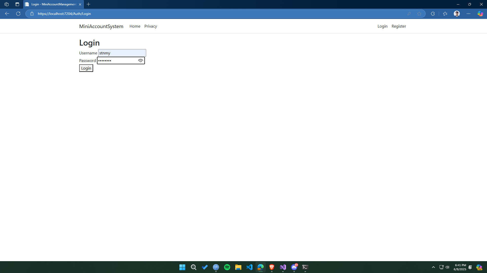
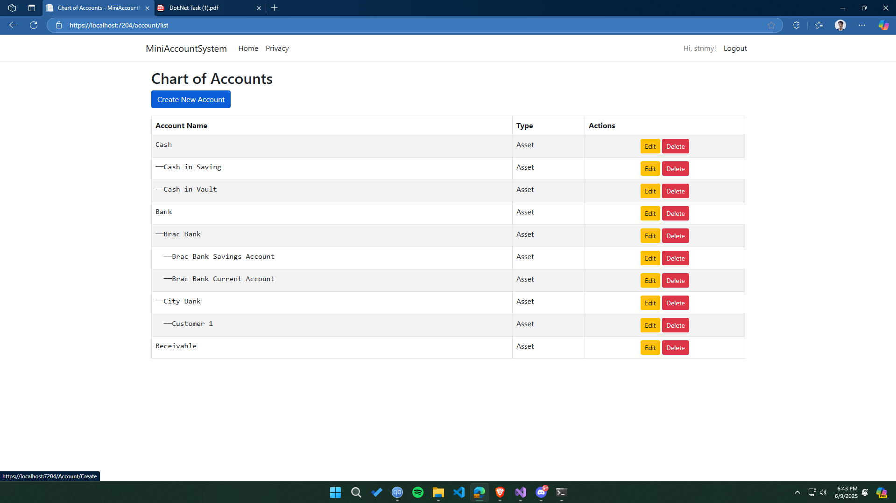
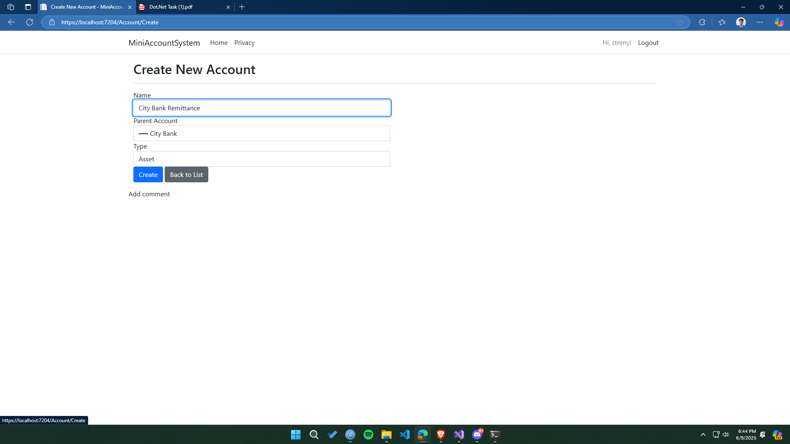
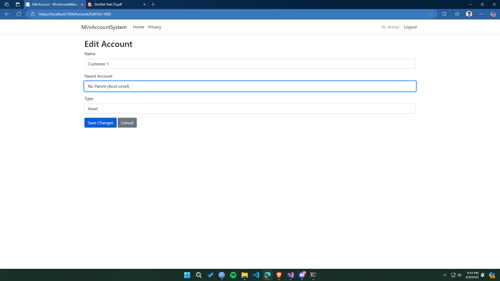
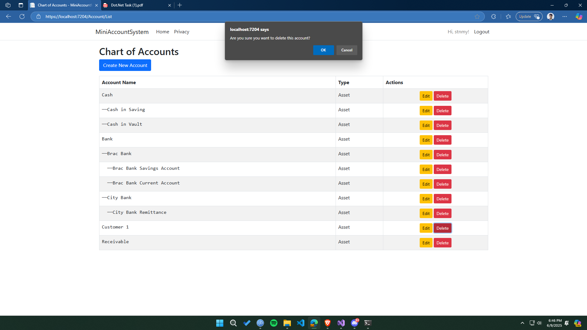
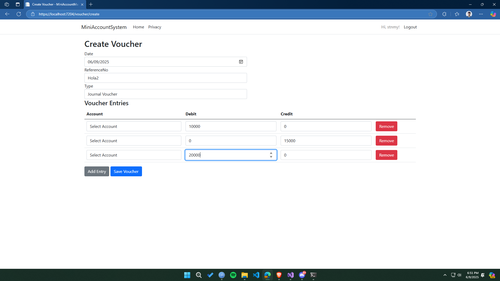
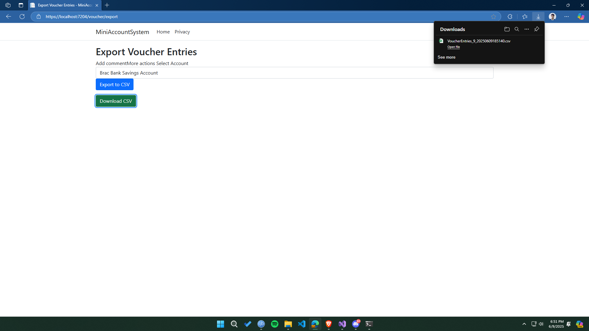
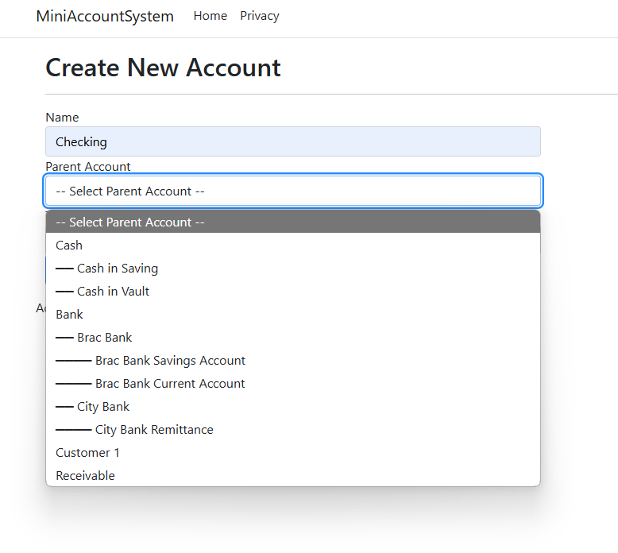

# MiniAccountManagementSystem

Assingment for Junior .Net Developer position at Qtec Solution Limited

# Features Implemented
- user registration, login, and logout
- role Based Access Control over different modules (Admin, accountant, viewer)
- parent children type relationship between accounts
- tree like indentation for accounts with child parent relation
- create Voucher with support to add voucher entry to multiple accounts by 
- [Bonus] voucher entries report can be exported as a csv for a specific account.
- show relevant error information in the ui, example- showing viewer "you dont have permission to create account"

# Implementation Sequence
- Started with user registration, login, and logout, to get basic authentication working.
- Built the account module, including parent-child relationships to form a tree of accounts.
- Then moved on to the voucher creation, with entries across multiple accounts.
- Added role-based access control to restrict access to certain functionalities based on user roles.
- [Bonus]Exporting voucher entries report to CSV for a specific account.
- Made the readme file more informative with installation instructions and screenshots.

# Screenshots

# Installation Process
- clone repository (https://github.com/stnmy/MiniAccountManagementSystem.git)
- create database named "MiniAccountManagementSystem" 
- run the all the scripts from Database/Table folder to create necessary tables
- run all the stored procedures from Database/StoredProcedure folder.
- add connection string in appsettings.json file
- run the application